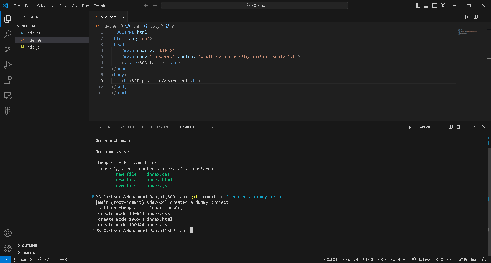

# SCD Lab 
## Git Assignment

*Created a dummy project which includes an index.js , index.html and index.css files, and a folder named Assets which includes Screenshot of the git commands.*

**Its a Dummy project just for Lab Assignment & Quiz**

***Thank you for reading***

